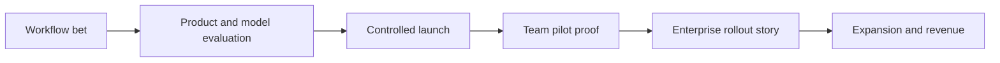

# Strategy, GTM, and Operating Model

## Question This File Answers

How would I position, grow, and run this product as a serious business?

## PM Skills Demonstrated

- `positioning-statement`: sharpens who the product is for, what problem it solves, and why it is different
- `product-strategy-session`: connects positioning, discovery logic, GTM motion, and roadmap implications
- `altitude-horizon-framework`: keeps the operating model at the right leadership scope and time horizon

## In One View

- Win repeated usage in a narrow set of high-frequency coding workflows.
- Turn that usage into trusted team rollout.
- Use team rollout proof to support enterprise expansion.

## Positioning

### Category-level positioning statement

For software teams that want AI help inside real coding workflows, Project Forge is an AI coding assistant that improves repo-aware editing, debugging, testing, and PR review work without making trust and team rollout an afterthought.

Unlike products that stop at demo-quality assistance or solo-user novelty, this strategy treats workflow fit, trust signals, and team adoption as one product system.

## Core Product Surfaces

The product strategy is built around explicit assistant surfaces, not generic "AI capability."

| Surface | What good looks like |
|---|---|
| Repo context | The assistant pulls the right files, symbols, and history fast enough to be useful |
| Edit loop | The assistant produces inspectable diffs that developers accept, modify, or reject with confidence |
| Debug and test loop | The assistant helps diagnose failures, propose fixes, and repair tests without fabricating certainty |
| PR and review loop | The assistant helps summarize changes, explain reasoning, and support review response |
| Team trust layer | Teams can set expectations and evaluate value without turning the product into bureaucracy |

## Strategic Wedge

I would not try to win every coding moment first.

I would start by owning a compact set of repeated workflows where value is visible and trust can compound:

- repo-aware edit loops
- debugging and fix suggestions
- test creation and repair
- PR preparation and review explanation

These workflows create the best bridge between:

- individual utility
- measurable team value
- enterprise rollout credibility

This is the key portfolio choice: narrower wedge, stronger trust, better expansion logic.

## Product Strategy

### Stage 1: Win repeated individual usage

Goal:
Make the assistant reliably useful enough that developers come back without being pushed.

Product consequences:

- reduce setup friction
- make repo-context handling legible
- support reversible edits and clear references
- improve output quality on narrow, repeated tasks
- reduce time to first useful diff

### Stage 2: Convert pull into team adoption

Goal:
Help engineering teams standardize use without feeling like they are trading quality for speed.

Product consequences:

- team-level settings and standards
- usage and trust signals for leads
- review-friendly diff, explanation, and PR patterns
- clearer rollout guidance

### Stage 3: Scale through enterprise expansion

Goal:
Give enterprise buyers a credible reason to expand usage rather than run isolated pilots forever.

Product consequences:

- rollout design tied to measurable workflows
- packaging anchored in team value, not raw seat count alone
- support for governance and integration concerns that affect mainstream adoption

## Assistant Evaluation System

This category requires evals that reflect coding-assistant reality, not just model benchmark quality.

I would track product-facing evals by workflow:

| Workflow | Example evals |
|---|---|
| Repo-aware edit loop | accepted diff rate, file-reference accuracy, time to first useful diff |
| Debug loop | issue-to-fix success rate, root-cause explanation usefulness, failed-fix retry rate |
| Test loop | test generation usefulness, test repair success, percent of assisted changes that pass baseline checks |
| PR loop | usefulness of PR summary, review-comment response quality, percent of assisted changes considered review-ready |

These are better PM signals than raw prompt volume or generic benchmark scores because they measure whether the assistant actually helps developers code and ship.

## Go-To-Market Motion

The GTM motion should follow the product truth rather than fight it.

| Motion layer | What it needs to prove | Product implication |
|---|---|---|
| Individual self-serve | "This helps me right now" | Fast time-to-value and obvious workflow utility |
| Team pilot | "This helps us without creating review chaos" | Trust signals, settings, and team-visible outcomes |
| Enterprise rollout | "This is worth standardizing and funding" | Governance, evaluation clarity, expansion narrative |

### Packaging principle

Do not force the product into a fake split between "consumer-like delight" and "enterprise controls."

The right model is:

- a strong individual product that creates pull
- a team layer that supports standards and visibility
- an enterprise layer that reduces rollout friction

That packaging logic matters because it keeps the enterprise story anchored to actual product behavior.

## Operating Model

This is where product, science, engineering, design, and GTM stay aligned.

### Planning stack

| Layer | Question it answers | Format | Owner |
|---|---|---|---|
| Category thesis | Where do we believe the market will be won? | Strategy memo | PM |
| Workflow bet | Which developer workflow are we trying to own next? | Epic hypothesis | PM + design + engineering |
| Evaluation plan | How will we know the bet worked? | Bet scorecard | PM + science + engineering |
| Release decision | Is this ready for broader exposure? | Launch review | PM + eng + design + GTM |
| GTM consequence | What can sales, marketing, and success now credibly say? | Enablement brief | PM + GTM |

### Core cadences

| Cadence | Attendees | Purpose | Output |
|---|---|---|---|
| Weekly product-science review | PM, science, engineering | Review coding-assistant evals, error patterns, and quality shifts | Bet health and model-product implications |
| Weekly workflow review | PM, design, eng lead | Review edit, debug, test, and PR friction plus user trust feedback | Prioritized product changes |
| Biweekly GTM sync | PM, sales, marketing, success | Align on pilots, objections, proof points, and rollout blockers | Updated messaging and pilot learnings |
| Monthly roadmap review | PM leadership, eng leadership, design, GTM lead | Re-rank bets and tradeoffs based on learning | Roadmap changes and decisions |

## Decision Rules

### Rule 1: Do not broaden before you are trusted

If the product is still unreliable in high-frequency edit, debug, test, or review workflows, breadth is a distraction.

### Rule 2: Do not sell what the product cannot yet support repeatedly

Enterprise traction that outruns product truth creates roadmap debt.

### Rule 3: Do not let evals become a science-only artifact

The eval stack must answer product questions, not just model questions.

### Rule 4: Measure adoption in completed work, not just interaction volume

Prompt count is weak. Time to useful diff, edit acceptance, test-pass contribution, review usefulness, repeat usage, and pilot expansion are stronger.

## What A Hiring Manager Should Notice Here

- The wedge is explicit around coding-assistant surfaces rather than generic AI productivity.
- GTM is treated as part of the product system.
- Product-science collaboration has operating structure, not just aspiration.
- The decision rules are designed to resist predictable category mistakes.

## Product-to-GTM System View

## Anti-Patterns

### Science-led roadmap without workflow framing

This creates impressive capability progress with weak product legibility.

### Sales-led roadmap without product discipline

This creates enterprise noise and weak mainline product coherence.

### UX smoothing without coding workflow depth

Pleasant surfaces do not compensate for weak repo context, bad diffs, or unreliable debug and review behavior.

## Read Next

[Roadmap](04-roadmap.md)
