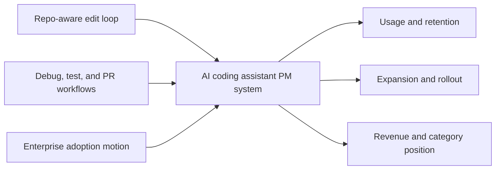

# Hiring Manager Summary

## What Project Forge Shows

Project Forge is designed to help a hiring manager answer a practical question quickly:

Can this candidate define and execute product strategy for an AI coding assistant, not just describe one?

## In One Page

| What I am demonstrating | What it looks like in practice |
|---|---|
| Category-level product thinking | I define how an AI coding assistant wins through repo-aware editing, debug-test support, PR assistance, trust, and team rollout rather than benchmark marketing |
| Strong developer-product judgment | I frame the real jobs developers, tech leads, and rollout owners need solved inside coding workflows |
| Product and GTM integration | I connect self-serve adoption, team expansion, and enterprise packaging into one motion |
| Decision-quality discipline | I show how assistant-specific roadmap bets, evals, and rollout choices would be managed as explicit hypotheses |
| Leadership-level operating model | I define how product, science, engineering, design, and GTM teams stay aligned without status theater |

## Role-Fit Evidence

| Hiring signal | Where to look |
|---|---|
| Can define product strategy for an AI coding assistant category | [01-category-thesis.md](01-category-thesis.md) |
| Understands coding workflows and buying stakeholders | [02-user-jobs-and-problems.md](02-user-jobs-and-problems.md) |
| Can connect coding-assistant product strategy to GTM and evals | [03-strategy-gtm-and-operating-model.md](03-strategy-gtm-and-operating-model.md) |
| Can prioritize and sequence coding-assistant bets | [04-roadmap.md](04-roadmap.md) |
| Can take one core assistant workflow to execution depth | [05-flagship-initiative.md](05-flagship-initiative.md) |
| Can enter the role and measure a coding assistant sanely | [06-scorecard-and-90-day-plan.md](06-scorecard-and-90-day-plan.md) |
| Can define assistant-specific product evals | [07-assistant-eval-philosophy.md](07-assistant-eval-philosophy.md) |
| Can choose a defensible category wedge | [08-competitive-wedge-memo.md](08-competitive-wedge-memo.md) |

## PM Skill Spine

This is not just a portfolio narrative. It is built from explicit PM skills and frameworks from the local PM skills library.

- `jobs-to-be-done` and `problem-statement` show user and problem quality
- `product-strategy-session`, `positioning-statement`, and `roadmap-planning` show strategy and sequencing judgment
- `epic-hypothesis`, `prd-development`, and `user-story` show execution depth
- `executive-onboarding-playbook` and `altitude-horizon-framework` show product leadership altitude

See [ARTIFACTS_AND_SKILLS.md](ARTIFACTS_AND_SKILLS.md) for the full artifact-to-skill map.

## The System I Would Run

## What Matters Most In My Approach

- I do not confuse model performance with product-market fit. The assistant must earn repeat behavior inside real coding workflows.
- I do not treat enterprise needs as a late-stage compliance layer. Team trust is part of the core product.
- I do not let roadmap decisions float on opinion alone. Major assistant bets need explicit hypotheses, evaluation logic, and kill signals.
- I do not separate product strategy from GTM. In this category, adoption motion is part of the product design.
- I optimize for legibility: developers know why the product is useful, GTM knows what it can credibly promise, leadership knows which signals matter.

## If You Only Read Three Files

1. [Category Thesis](01-category-thesis.md)
   This shows how I think about the category.
2. [Strategy, GTM, and Operating Model](03-strategy-gtm-and-operating-model.md)
   This shows how I would run the product.
3. [Flagship Initiative](05-flagship-initiative.md)
   This shows how I turn the strategy into execution.
4. [Assistant Eval Philosophy](07-assistant-eval-philosophy.md)
   This shows how I would separate product truth from benchmark theater.

## What You Should Conclude

- I understand the difference between an exciting coding demo and a durable coding-assistant product business.
- I can connect developer empathy to enterprise monetization without flattening either.
- I can translate ambiguity into a roadmap and operating model that a cross-functional org could actually use.
- I can present public portfolio work without turning it into methodology theater.

## Best Fit

This portfolio is most relevant for organizations that:

- build AI-native developer or technical workflow products
- need to convert model strength into workflow value
- are balancing self-serve growth with enterprise expansion
- want a PM who can work credibly across research, engineering, design, and GTM

## Back To

[README](README.md)
