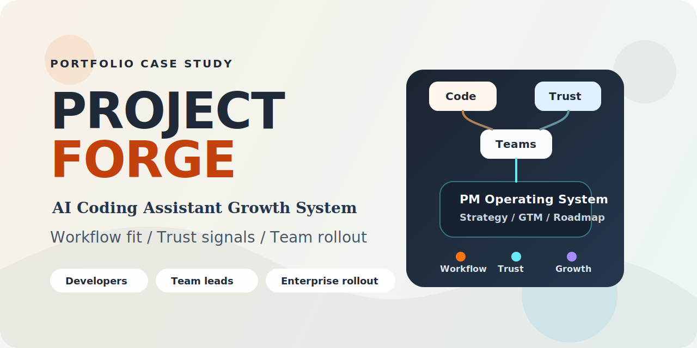
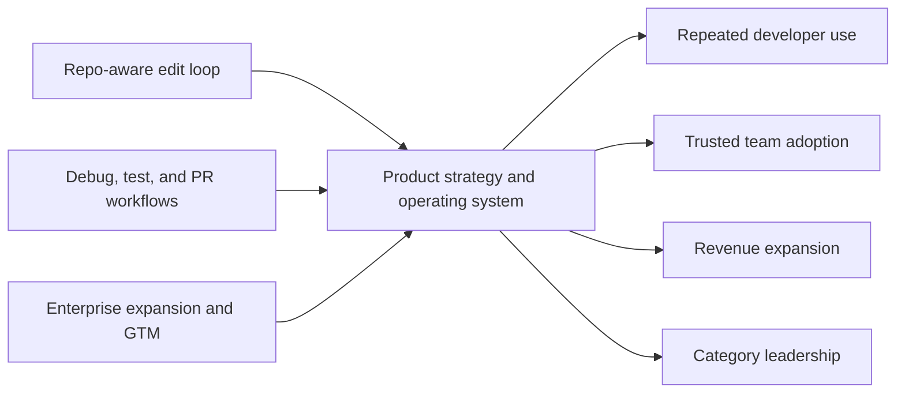

# Project Forge: Product Strategy for an AI Coding Assistant

Prepared by [@7ahir](https://github.com/7ahir)

GitHub social preview upload asset: [assets/project-forge-social-preview.png](assets/project-forge-social-preview.png)

> A recruiter-facing portfolio project on how I would define strategy, evals, roadmap, and GTM for a GenAI-native coding assistant for developers.

For hiring managers:
- this is explicitly about an AI coding assistant, not generic AI workflow software
- the core product surfaces are repo-aware edits, debug-test loops, and PR review assistance
- every metric in the repo is illustrative or simulated

## Best Fit Roles

This portfolio is optimized for roles such as:

- product manager or product lead for AI-native developer tools
- product leader for LLM-powered workflow products
- product manager bridging research, engineering, and enterprise GTM

## What This Is

Project Forge shows how I would define strategy, GTM, roadmap, and operating model for a GenAI-native coding assistant:

- used by developers inside IDE and repository workflows
- adopted by engineering teams for edit, debug, test, and review work
- expanded through enterprise rollout once trust and workflow value are proven

This is a simulated case study based on common patterns in AI developer tools. Company names, product names, and private-sounding specifics are intentionally excluded. Any numbers in this repo are illustrative or simulated and are used to show decision quality, not insider knowledge.

## The Core Thesis

AI coding assistants do not become market leaders because the model benchmark looks strong in a launch post.

They win when three things become true at the same time:

- developers trust the assistant inside real edit-test-review loops
- teams can adopt it without losing control, standards, or visibility
- the product team can prove workflow value, not just model capability

Project Forge shows how I would do that.

## The Specific Product Surface

This project is explicitly about coding-assistant product strategy, not generic AI workflow software.

The portfolio focuses on four assistant surfaces:

- repo-aware code edits
- debugging and fix iteration
- test generation and repair
- PR and code-review assistance

## What This Portfolio Proves

- I can define a category thesis instead of reacting to feature noise.
- I can connect assistant-specific workflow truth to enterprise growth.
- I can turn strategy into roadmap, operating cadence, and one flagship bet.
- I can label assumptions clearly when the scenario is simulated.

## System View

## How To Read This

| Time | Path | What you will get |
|---|---|---|
| 2 min | [Hiring Manager Summary](HIRING_MANAGER_SUMMARY.md) | Fastest read on my point of view and what this portfolio proves |
| 5 min | [Project Brief](00-project-brief.md) -> [Category Thesis](01-category-thesis.md) -> [Roadmap](04-roadmap.md) | Strategic framing, role thesis, and roadmap logic |
| 20 min | Add [Strategy, GTM, and Operating Model](03-strategy-gtm-and-operating-model.md) -> [Flagship Initiative](05-flagship-initiative.md) -> [Assistant Eval Philosophy](07-assistant-eval-philosophy.md) | How I would actually run the product, not just describe it |
| Deep dive | Follow the files in order from `00` to `08` | Full diagnosis-to-execution narrative |

## Artifact Map

| Phase | Artifact | What it demonstrates |
|---|---|---|
| 0. Framing | [Project Brief](00-project-brief.md) | Strategic framing, assumptions, and PM skill spine |
| 1. Point of view | [Category Thesis](01-category-thesis.md) | Clear thesis on how AI coding assistants win or fail |
| 2. User truth | [User Jobs and Problems](02-user-jobs-and-problems.md) | Developer workflow understanding across edit, debug, test, and review jobs |
| 3. Operating system | [Strategy, GTM, and Operating Model](03-strategy-gtm-and-operating-model.md) | Coding-assistant positioning, evals, adoption motion, and product-science-GTM orchestration |
| 4. Direction | [Roadmap](04-roadmap.md) | Sequenced bets across code context, edit loops, debug-test loops, PR assistance, and rollout |
| 5. Execution depth | [Flagship Initiative](05-flagship-initiative.md) | One coding-assistant initiative with enough depth to prove product judgment |
| 6. Measurement and entry | [Scorecard and 90-Day Plan](06-scorecard-and-90-day-plan.md) | Coding-assistant metrics, eval logic, and how I would enter the role without thrash |
| 7. Eval judgment | [Assistant Eval Philosophy](07-assistant-eval-philosophy.md) | How I would evaluate a coding assistant as a product, not just a model |
| 8. Competitive choice | [Competitive Wedge Memo](08-competitive-wedge-memo.md) | Where I would choose to win in the category and what I would not chase early |

## PM Skills and Framework Coverage

This project uses the local PM skills framework from `/Users/tahiro/projects/Product-Manager-Skills`, but the main docs deliberately foreground choices and artifacts before framework labels.

For reviewers who want the PM craft made explicit:

- [ARTIFACTS_AND_SKILLS.md](ARTIFACTS_AND_SKILLS.md) maps each artifact to the PM skills, frameworks, and hiring signals it proves
- each core artifact includes a short `PM Skills Demonstrated` section near the top

## Start Here

If I were sending this to a hiring manager, I would point them to:

1. [HIRING_MANAGER_SUMMARY.md](HIRING_MANAGER_SUMMARY.md)
2. [03-strategy-gtm-and-operating-model.md](03-strategy-gtm-and-operating-model.md)
3. [05-flagship-initiative.md](05-flagship-initiative.md)
4. [07-assistant-eval-philosophy.md](07-assistant-eval-philosophy.md)

## Fast Role-Fit Map

| If you are assessing for | Read |
|---|---|
| Product strategy and category judgment | [01-category-thesis.md](01-category-thesis.md) |
| Developer empathy and coding workflow understanding | [02-user-jobs-and-problems.md](02-user-jobs-and-problems.md) |
| GTM, evals, and assistant operating model | [03-strategy-gtm-and-operating-model.md](03-strategy-gtm-and-operating-model.md) |
| Prioritization and sequencing of coding-assistant bets | [04-roadmap.md](04-roadmap.md) |
| Execution depth on a core assistant workflow | [05-flagship-initiative.md](05-flagship-initiative.md) |
| Leadership entry and assistant metrics | [06-scorecard-and-90-day-plan.md](06-scorecard-and-90-day-plan.md) |
| Assistant-specific eval judgment | [07-assistant-eval-philosophy.md](07-assistant-eval-philosophy.md) |
| Competitive wedge and strategic focus | [08-competitive-wedge-memo.md](08-competitive-wedge-memo.md) |

## Scenario

A growth-stage AI company has a strong technical foundation and rising demand for its GenAI-native coding assistant.

The product challenge is not whether the assistant can generate code in a chat box. The challenge is whether the business can turn model strength into:

- repeated usage inside repo-aware edit, debug, test, and PR workflows
- trusted team adoption
- scalable enterprise expansion

without collapsing into benchmark theater, custom enterprise work, or unsafe product sprawl.

## What Success Looks Like

Within two to three planning cycles, the product should be visibly better at:

- helping developers complete real tasks faster with less friction
- earning trust in repo-aware edits, debugging, tests, and PR review workflows
- converting individual pull into team rollout
- making evaluation and quality signals legible to leadership
- creating an enterprise motion that does not break the product

## What A Hiring Manager Should Take Away

- Does this person understand the real job-to-be-done behind an AI coding assistant?
- Can they separate model excitement from workflow value?
- Can they connect user trust, product strategy, and GTM into one system?
- Can they work at product leadership altitude without losing developer empathy?
- Can they build a public artifact that feels like real PM work instead of polished methodology theater?

## About

Built by Tahir T. as a public portfolio project to demonstrate product leadership judgment for AI-native developer products.
